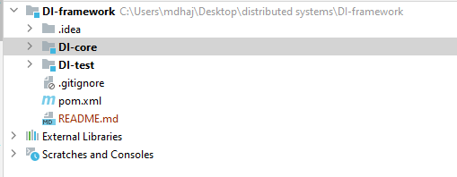
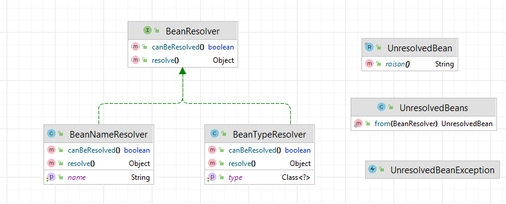

# Framework d'injection de dependances basé sur les annotations

## Le but
le but de cette partie est de créer un framework comme spring qui permet de faire
**l'injection des dépendances**, à travers plusieurs **annotations** qu'on a créés.


## La structure de projet

notre projet est divisé sur deux modules:
* le premier module `DI-core` qui contient l'implementation du framework.
* le second module `DI-test` pour tester notre solution sur un cas réél.




## le module DI-core 

dans ce module on a essayé d'implementer une solution qui permete 
de faire l'injection des dépendances, ce module est organisé comme ceci:


### package annotations
commencant par le package des `annotations`, on a créé plusieurs annotations 
qui seront détéctés au moment d'éxécution, ces annotations sont :

* `@Component` : cette annotation est distinée aux classes, que l'on souhaite l'instancier, on peut spécifie le nom au bean créé:
```java
    @Target(METHOD)
    @Retention(RUNTIME)
    public @interface Bean {
        String value() default "";
    }
```
* `@BeansFactory`: cette annotation est similaire de l'annotation `@Configuration` du **spring** distiniée aux classes, 
    ces classes vont contient des méthodes spécifique (annoté par `@Bean`) qui vont applés au moment du démarrage de l'application
    pour créer un nouvean bean,comme **spring** généralement on utilise ce genre d'instanciation pour les classes qui 
    sont déja définis et qu'on ne peut pas les ajoutées l'annotation `@Component`.
```java
    @Target(TYPE)
    @Retention(RUNTIME)
    public @interface BeansFactory {
    }


```
* `@Bean`: équivalent de l'annotation `@Bean` celle de **Spring**, elle permet de créer des beans en exécutant la méthode annoté, 
    le nom du bean sera le nom passé en paramètre de l'annotation 
    , sinon le nom du bean sera le nom du méthode , ainsi le type du bean sera le type de retour de la méthode, on peut spécifier le nom du bean:
```java
    @Target(METHOD)
    @Retention(RUNTIME)
    public @interface Bean {
        String value() default "";
    }

```

* `@inject`: cette annotation permet d'injecter des beans dans les éléments annotés, qui sont :
    - les constructeurs
    - le attribus
    - les setters
```java
    @Target({FIELD, CONSTRUCTOR, METHOD})
    @Retention(RUNTIME)
    public @interface Inject {
    }
```
* `@Prefer`: cette annotation peut etre utilisé avec `@Inject`, pour favoriser ou spécifier qu'il est le bean
  (en donnant le nom du bean en paramètre) :
```java
    @Target({FIELD, PARAMETER})
    @Retention(RUNTIME)
    public @interface Prefer {
        String value();
    }
```


### package repository

dans ce package on a essayé d'implémenter `le pattern singleton` 
pour avoir une sorte d'une répositorie dans 
laquelle les notre bean créés seront stocké, on sait bien que 
la meuilleure facon d'implémenter le pattern singleton se sont des `Enumérations`, car ils ne permettent
de bien controler le nombre des instances qu'on veut dans notre application:


* `INSTANCE`: la seule instance qu'on a crée:
* `context`: c'est un attribut de type `Map<String, Object>`:
```java
    private final Map<String, Object> context = new ConcurrentHashMap<>();
```
* les autres méthodes comme : `size()` `saveBean(...)`, `beanExist(...)`, `getBean(...)`: pour manipuler l'attribut context.

### package resolvers



